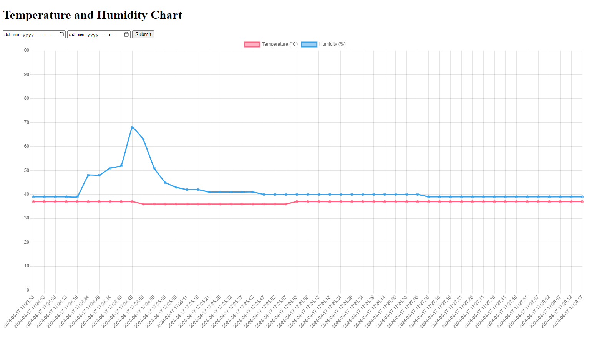

# Weather Monitoring System

## Description
The Weather Monitoring System is a project designed to collect weather data, store it in a database, and visualize it through a web interface. The system consists of the following components:
- Backend API built with FastAPI
- Frontend web interface using Chart.js for data visualization
- NodeMCU device to collect weather data and send it to the backend API

## Features
- **Backend API**: Utilizes FastAPI to create RESTful endpoints for data collection and retrieval.
- **Data Visualization**: Utilizes Chart.js to create interactive and visually appealing charts for displaying weather data.
- **NodeMCU Integration**: NodeMCU device collects weather data (e.g., temperature, humidity) and sends it to the backend API for storage and analysis.

## Setup
1. **Backend Setup**:
    - Install Python and FastAPI.
    - Clone the repository and navigate to the backend directory.
    - Install dependencies using `pip install -r requirements.txt`.
    - Run the FastAPI server using `python server.py`.
      
2. **NodeMCU Setup**:
    - Connect the NodeMCU device to your computer.
    - Add the dht11 library using the below zip file.
    - Add your Wifi endpoint credentials in the sketch.ino file.

## Usage
- Access the frontend web interface to view weather data visualizations.
- Configure the NodeMCU device to send weather data to the backend API at regular intervals.

## Dashboard:

## Hardware:

## Contributors
- [Rishabh Prajapati](https://github.com/MercyShark)

## License
This project is licensed under the [MIT License](LICENSE).
